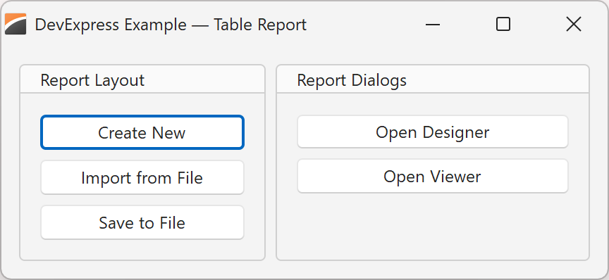

<!-- default badges list -->

[](https://supportcenter.devexpress.com/ticket/details/T1306454)
[](https://docs.devexpress.com/GeneralInformation/403183)
[](#does-this-example-address-your-development-requirementsobjectives)
<!-- default badges end -->

# DevExpress Reports for Delphi/C++Builder – Import and Save Report Layouts to XML Files

This example uses XML-based REPX files as [report layout][vcl-reports] storage.

Run the app and execute the following actions:

-   Customize our predefined layout and save it to a new file.
-   Create a new report layout and save it to a file.
-   Import a report layout you created earlier from a file.



---

## Prerequisites

[DevExpress Reports Prerequisites][req]

[req]: https://docs.devexpress.com/VCL/405773/ExpressCrossPlatformLibrary/vcl-backend/reports-dashboards-app-deployment#vcl-reportsdashboards-prerequisites


## Implementation Details

### Import a Report Layout from a File

To import (load) a report layout from a file, call the [Layout.LoadFromFile]
method and assign a name to the [ReportName] property:

<!-- start-code-block -->
#### Delphi
```delphi
procedure TMainForm.ImportReport(const AFileName: string);
begin
    // Import a report layout from a file
    dxReport1.Layout.LoadFromFile(AFileName);
    // Assign the file's name as an internal report name
    dxReport1.ReportName := ChangeFileExt(ExtractFileName(AFileName), '');
end;
```

#### C++Builder
```cpp
void __fastcall TMainForm::ImportReport(const String &FileName)
{
    // Import a report layout from a file
    dxReport1->Layout->LoadFromFile(FileName);
    // Assign the file's name as an internal report name
    dxReport1->ReportName = ChangeFileExt(ExtractFileName(FileName), "");
}
```
<!-- end-code-block -->

> [!Note]
> An internal report name may differ from the source REPX file name.


### Save a Report Layout to a File

To save the current report layout to a file, call the [Layout.SaveToFile] method:

<!-- start-code-block -->
#### Delphi
```delphi
procedure TMainForm.SaveReport(const AFileName: string);
begin
    // Save the report layout to a file
    dxReport1.Layout.SaveToFile(AFileName);
end;
```

#### C++Builder
```cpp
void __fastcall TMainForm::SaveReport(const String &FileName)
{
    // Save the report layout to a file
    dxReport1->Layout->SaveToFile(FileName);
}
```
<!-- end-code-block -->

> [!Note]
> Internal report names are not stored in REPX files.


## Test the Example

### Modify the Pre-loaded Layout and Save to a New File

The example application loads a predefined layout at startup: [TableReport.repx].
You can modify this preloaded report layout and then save changes to a REPX file.

1.  Build and run the sample application. 
    Note the preloaded layout's name in the application's caption.
2.  Click **Open Designer** to edit the loaded layout in the DevExpress
    [Report Designer][designer].
    Modify the layout as you see fit.
3.  Once you have made changes in the **Report Designer** dialog, click the hamburger button, select **Save**, and close the dialog.
4.  Click **Save to File** to save the report layout to a REPX file.
    You can overwrite an existing file or create a new file.
5.  Restart the application and click **Import from File** to import a report layout from the previously saved REPX file.
6.  Click **Open Viewer** to display the imported layout in the DevExpress
    [Report Viewer][viewer].


### Create, Design, and Save a New Layout

You can design a new layout from scratch and then save it to a REPX file:

1.  Build and run the sample application.
2.  Click **Create New** to open a new blank report layout in the DevExpress
    [Report Designer][designer].
3.  Design the report layout (template) using tools available in the **Report Designer**.  
    Follow the tutorial: [Create a table report using the Report Wizard][wizard-tutorial].
4.  Once you have made all necessary changes in the **Report Designer** dialog, click the hamburger button, select **Save**, and enter a report layout name.
    Click **Save** and close the dialog.
5.  Click **Save to File** to save the report layout to a REPX file.
6.  Restart the application and click **Import from File** to import a report layout from the previously saved REPX file.
7.  Click **Open Viewer** to display the imported layout in the DevExpress
    [Report Viewer][viewer].


## Files to Review

-   [uMainForm.pas] (Delphi) and [uMainForm.cpp] (C++Builder) import and save report layouts to REPX files.
-   [TableReport.repx] contains a report layout designed to generate a customer order report.

[uMainForm.pas]: ./Delphi/uMainForm.pas
[uMainForm.cpp]: ./CPB/uMainForm.cpp
[TableReport.repx]: ./Table%20Report.repx

## Documentation

-   [Introduction to VCL Reports][vcl-reports]
-   [Tutorial: Create a table report using the Report Wizard][wizard-tutorial]
-   [Store report layouts in REPX files at design-time](https://docs.devexpress.com/VCL/dxReport.TdxReport.Layout#string-list-editor)
-   [Use SQLite as a data source for reports (as demonstrated in the current example)](https://docs.devexpress.com/VCL/405750/ExpressCrossPlatformLibrary/vcl-backend/database-engines/vcl-backend-sqlite-support)
-   API reference: 
    -   [TdxReport.Layout]
    -   [TdxReport.Layout.LoadFromFile][Layout.LoadFromFile]
    -   [TdxReport.Layout.SaveToFile][Layout.SaveToFile]
    -   [TdxReport.ReportName][ReportName]
    -   [TdxBackendDatabaseSQLConnection]

[vcl-reports]: https://docs.devexpress.com/VCL/405469/ExpressReports/vcl-reports
[designer]: https://docs.devexpress.com/XtraReports/119176/web-reporting/web-end-user-report-designer
[viewer]: https://docs.devexpress.com/XtraReports/401850/web-reporting/web-document-viewer
[wizard-tutorial]: https://docs.devexpress.com/VCL/405760/ExpressReports/getting-started/create-table-report-using-report-wizard

[TdxReport.Layout]: https://docs.devexpress.com/VCL/dxReport.TdxReport.Layout
[Layout.LoadFromFile]: https://docwiki.embarcadero.com/Libraries/Athens/en/System.Classes.TStrings.LoadFromFile
[Layout.SaveToFile]: https://docwiki.embarcadero.com/Libraries/Athens/en/System.Classes.TStrings.SaveToFile
[ReportName]: https://docs.devexpress.com/VCL/dxReport.TdxReport.ReportName 
[TdxBackendDatabaseSQLConnection]: https://docs.devexpress.com/VCL/dxBackend.ConnectionString.SQL.TdxBackendDatabaseSQLConnection

## More Examples

-   [Store DevExpress VCL Report Layouts in a Database](https://github.com/DevExpress-Examples/vcl-reports-store-layout-template-database)
-   [Localize the DevExpress VCL Report Viewer and Report Designer UI](https://github.com/DevExpress-Examples/vcl-reports-localize)

<!-- feedback -->
## Does This Example Address Your Development Requirements/Objectives?

[](https://www.devexpress.com/support/examples/survey.xml?utm_source=github&utm_campaign=vcl-reports-store-layout-template-file&~~~was_helpful=yes) [](https://www.devexpress.com/support/examples/survey.xml?utm_source=github&utm_campaign=vcl-reports-store-layout-template-file&~~~was_helpful=no)

(you will be redirected to DevExpress.com to submit your response)
<!-- feedback end -->
